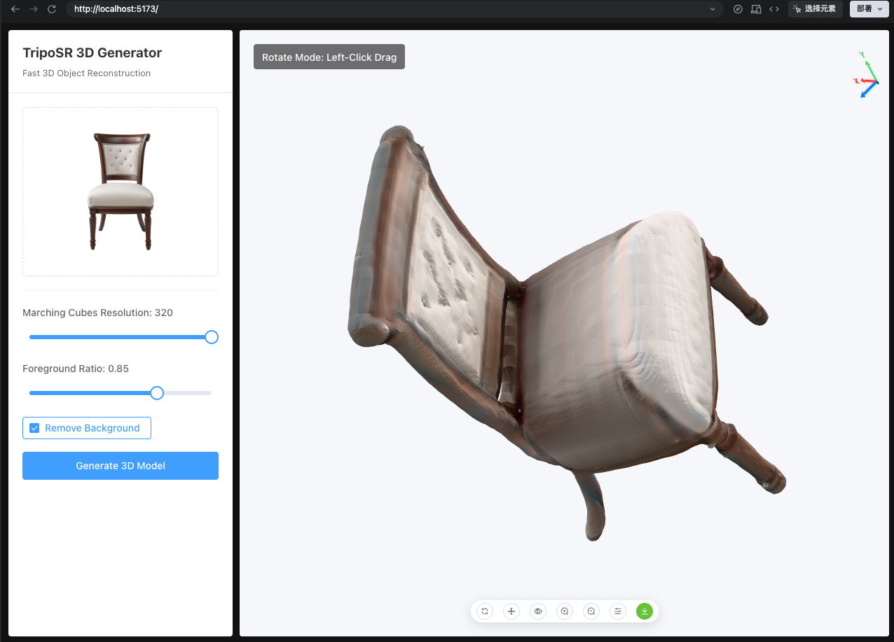

# TripoSR Web 应用程序

[English README](README.md) | [TripoSR 原项目地址](https://github.com/VAST-AI-Research/TripoSR)

本项目是 **TripoSR** 的 Web 界面，TripoSR 是一个先进的 3D 对象重建模型。用户可以上传单张图像，并在几秒钟内生成高质量的 3D 模型。

## 截图



## 架构

该应用程序由三个主要部分组成：

1.  **Tripo Server (`tripo-server`)**：一个 Python FastAPI 服务，托管 TripoSR 模型并处理核心的 3D 生成逻辑。
2.  **Web Server (`web-server`)**：一个 Node.js Express 服务器，作为中间件处理文件上传、存储以及与 Python 服务的通信。
3.  **Web Client (`web-client`)**：一个 Vue 3 + Vite 前端应用程序，提供用户界面。

## 先决条件

-   **Python 3.8+**（如果使用 GPU，则需要 CUDA 支持）
-   **Node.js 16+**
-   **npm** 或 **yarn**

## 部署说明

### 1. 设置 Tripo Server (Python)

进入 `tripo-server` 目录并安装依赖项：

```bash
cd tripo-server
pip install -r requirements.txt
```

**下载模型：**

启动前，请运行以下脚本下载所需的去背景模型 (`u2net.onnx`)：

```bash
python download_models.py
```

> 如果下载速度慢，您也可以手动下载 [u2net.onnx](https://github.com/danielgatis/rembg/releases/download/v0.0.0/u2net.onnx) 并将其放入 `tripo-server/.u2net/` 目录中。

启动 Python 服务：

```bash
# 代码会自动处理 U2NET_HOME，通常无需手动设置
python service.py
```

服务将在 `http://localhost:8000` 上启动。

### 2. 设置 Web Server (Node.js)

进入 `web-server` 目录并安装依赖项：

```bash
cd web-server
npm install
```

启动中间件服务器：

```bash
npm run dev
```

服务器将在 `http://localhost:3000` 上启动。

### 3. 设置 Web Client (Vue)

进入 `web-client` 目录并安装依赖项：

```bash
cd web-client
npm install
```

启动前端开发服务器：

```bash
npm run dev
```

客户端将在 `http://localhost:5173` 上可用。

## 使用方法

1.  在浏览器中打开 Web 客户端 (`http://localhost:5173`)。
2.  上传物体的图像（最好背景干净，虽然已包含去背景功能）。
3.  根据需要调整参数（分辨率、前景比例）。
4.  点击“生成 3D 模型” (Generate 3D Model)。
5.  实时查看、旋转和交互生成的 3D 模型。
6.  将模型下载为 `.glb` 文件。

## 功能特性

-   **快速重建**：在几秒钟内生成 3D 模型。
-   **交互式查看器**：旋转、缩放和平移 3D 模型。
-   **视图模式**：在默认、前视图、侧视图和顶视图之间切换。
-   **视觉辅助**：3D 坐标轴和线框/纹理切换。
-   **下载**：导出生成的模型以供其他 3D 软件使用。
